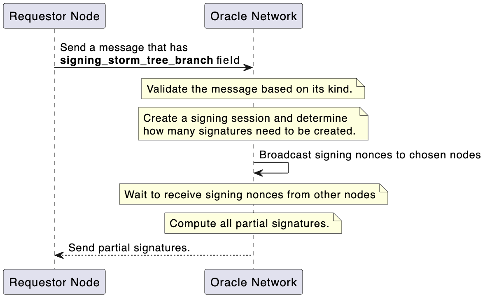
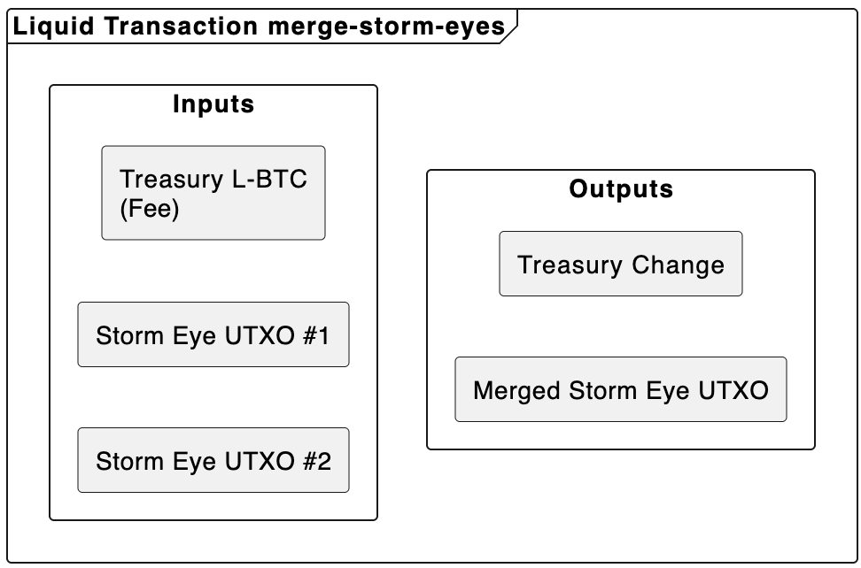
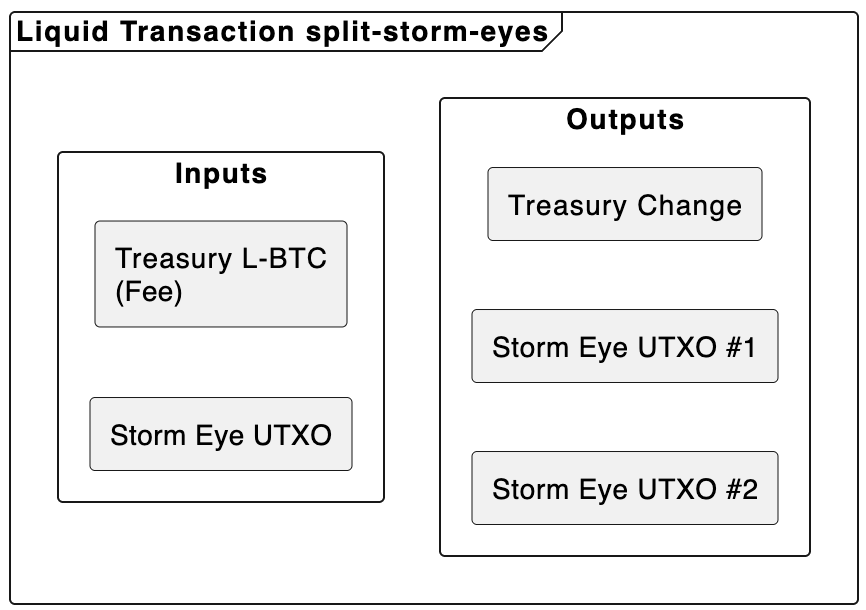
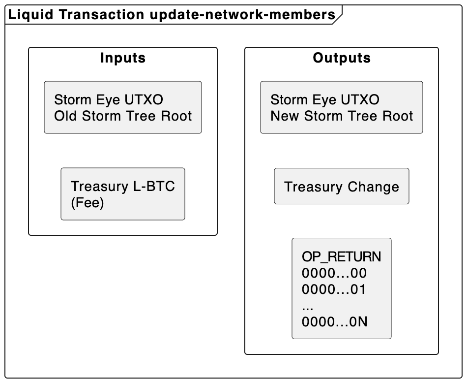
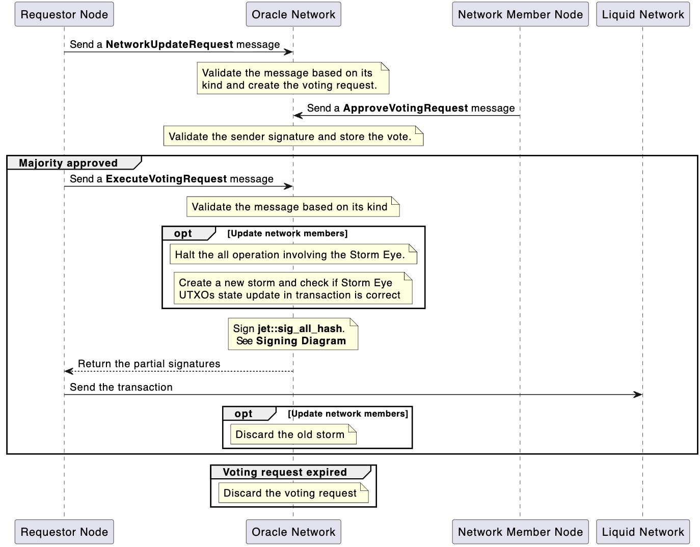
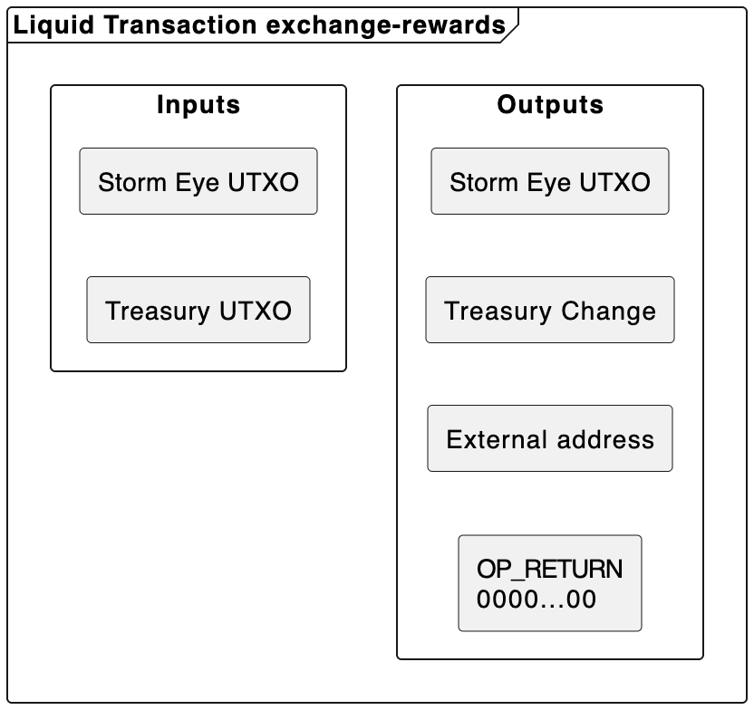
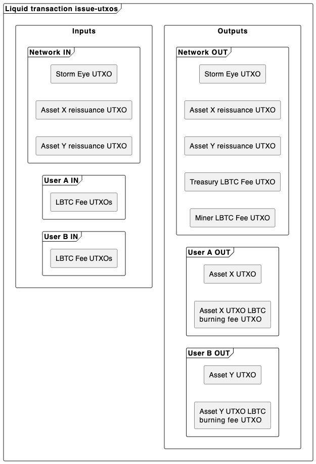
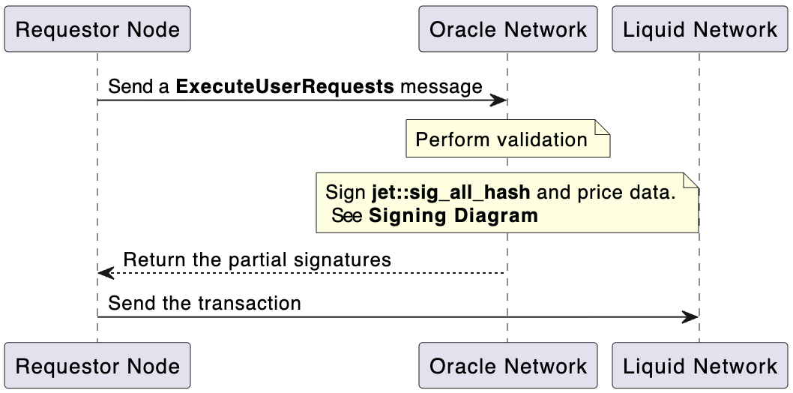
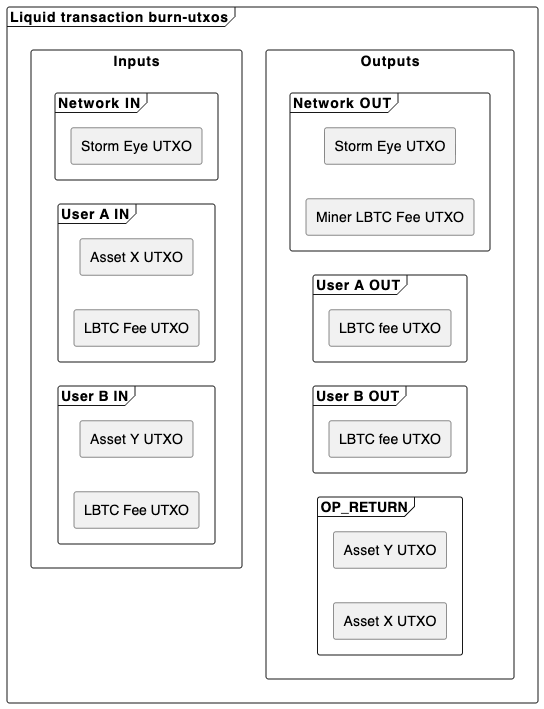
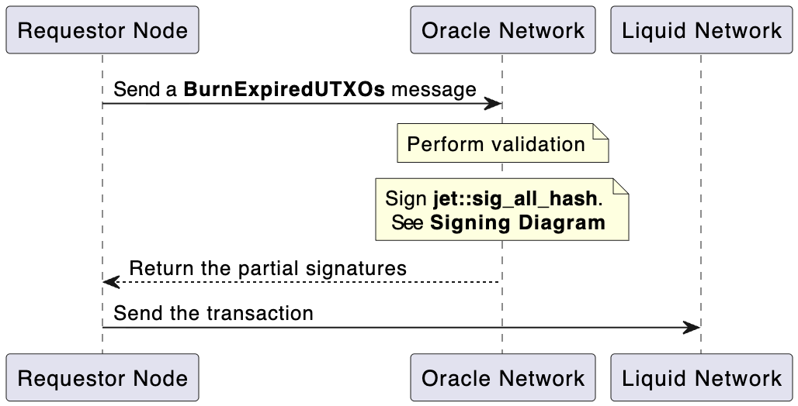

# Oracle Network Specification

## Introduction

This document describes a production-ready decentralized oracle network architecture that can run on Liquid. It covers the general network topology, leader selection mechanics, internal messaging protocol, state management, state synchronization, user request handling.

## Motivation

The purpose of this document is to describe the project architecture to fully capture the project scope for developers who will work on the implementation and for people being onboarded to the project.

# Part I. Network Topology

## 1\. Network model

The network operates as a fixed set of authenticated nodes with a fixed threshold. The number of nodes in this network is expected to be three or five, with the ability for further growth. 

Each node possesses a keypair. Nodes are expected to remain online almost permanently. 

**A network approval requires consensus of at least two-thirds of all nodes.**

## 2\. Network cryptography

**The nodes use SHA-256 for all hashing operations and the secp256k1 elliptic curve for all cryptographic keys.**

## 3\. Network leader

Within the Oracle network's internal system, the network leader is a node that can execute scheduled actions. Nodes take turns serving as network leaders, which is determined when a new Liquid block is mined.

**The network leader is chosen via round-robin by Liquid block height.**

## 4\. Network authorization

**Authorization of network-related transactions on Liquid occurs via a special UTXO that locks an exclusive network-owned asset**. If such a UTXO is present in a transaction, it means the network approved its spend.

This asset is locked behind MuSig2 signature verification, and the signature can only be produced by network approval. When the network members change, the state of this asset's UTXOs is updated accordingly, so only new members can operate with it.

For parallel user request handling, multiple such UTXOs exist for this asset.

**This special asset is referred to as Storm Eye.**

## 5\. Network users

An entity can be considered a network user when it creates a network user address for itself and funds it with LBTC. A user must have a Schnorr secp256k1 keypair, and to generate a network user address, they must pass their public key to the Network User Contract.

Network User Contract is a Simplicity contract that can only be spent by the network.

**User funds are used exclusively to cover Liquid transaction fees for user-requested actions and to pay a fee for oracle network operations.**

**The oracle network itself pays only for the treasury-related activity and the network migration.**

## 6\. Network coordinator node

Only one node can expose a REST API for the users at a time. This node is called the coordinator node as it is responsible for handling user requests and ensuring their execution.

When the network is created, the discovery node becomes the coordinator node by default. The coordinator public key is persisted as part of the network state. Only messages from this node may initiate user request handling.

## 7\. Network discovery node

A unique node is responsible for creating the first network state and inviting the first nodes.

The discovery node is responsible for creating the network assets and locking them behind the network state. It is also responsible for telling other nodes the network's communication information.

## 8\. Network indexer

Each node has an internal indexer that scans every new block for transactions that affect the network's on-chain components.

The indexer manipulates the internal node state by examining transaction inputs and outputs, as well as the data that some outputs may carry in OP\_RETURN.

**The Liquid chain observed by the indexer is a single source of truth of the oracle node state.**

## 9\. Network-issued UTXOs

Upon a user request, the network can issue specialized UTXOs, Tick UTXO and Oracle Verifier UTXO, on Liquid that have encoded information inside them. Users can then include these UTXOs inside their transaction to integrate with the oracle.

**Unless being spent, the network guarantees the freshness of the information stored inside these UTXOs by burning them after enough Liquid blocks have been mined.**

Currently, the network can issue the following list of possible UTXOs:

| Field | Description |
| :---- | :---- |
| Tick UTXO | A tick UTXO encodes a timestamp in its amount. |
| Oracle Verifier UTXO | Oracle Verifier UTXO carries a public key that can be used to verify the network signature. |

The lifecycle of such UTXOs is as follows:

| State | Description |
| :---- | :---- |
| Active | The UTXO was issued, but the expiration time has yet to come. |
| Expired | UTXO is in the queue to be burned. This status is assigned if 60 Liquid blocks (1 hour) have been recorded since the UTXO's creation. |
| Burning | Signals that a transaction is waiting to be mined and will burn this UTXO. The network leader tells the network to assign this state when it broadcasts the transaction. If the transaction was not mined in a window of 5 liquid blocks (five minutes), the status is reverted to expired. |
| Burned | This status is recorded when the indexer sees the transaction in a block that burned this UTXO. This state exists very briefly \- the node will delete this record after the indexer records 10 blocks (10 minutes) since it was assigned. |

## 10\. Network treasury

The network controls network funds on a specific address; these funds are used to pay rewards for the nodes that send network-changing transactions.

Funds to this address are received either from network operational fees paid by users or directly from a node.

Nodes keep track of internal tokens that each node can exchange to move funds from this address. If their indexer detects that the address received funds, each node receives an equal amount of internal tokens for their work. If the transaction that added the funds has an additional OP\_RETURN that records the public key of some specific node, only that node will receive the full amount of internal tokens.

Each transaction that removes funds from this address must include an OP\_RETURN output recording the public key of the node that removes funds, so that, by indexing this transaction, nodes can update their internal token state.

Currently, there are these purposes for which the funds from this address can be spent:

| Purpose | Description |
| :---- | :---- |
| Node reward | Node exchanges internal tokens for LBTC. |
| Network migration | Node starts the network migration and pays for the move of all Auth Asset UTXOs. |
| Auth Asset Merge | Combines Auth Asset UTXOs into a single one. |
| Auth Asset Split | Splits an Auth Asset UTXO into multiple. |

## 11\. Network requests

Each node maintains a communication instance with the rest of the network. Also, a coordinator node exposes a specialized REST API for the network users.

### 11.1 Network User Requests

A user can communicate with the network by sending a specific request to a coordinator node. Every network request is user-signed and accompanied by a list of UTXOs to cover the request's fees.

Network user requests follow a specific format.

```rust
struct Header {
    signature: String,
    public_key: String,
    fee_utxos: [String],
}

struct UserRequest {
    kind: u64,
    payload: String,
}

struct NetworkUserRequests {
    header: Header,
    requests: Vec<UserRequest>,
}
```

| Field | Description |
| :---- | :---- |
| `Header::signature` | A user signature that identifies the user. User signs a byte concatenation of the following: 1\. **Payload** – raw bytes payload stored inside the network user requests. 2\. **Fee UTXOs** – raw bytes of a concatenated array of fee UTXOs. The concatenation is then hashed with the `OracleNetowk/NetworkUserRequests` tag for a BIP-340 tagged hash. |
| `Header::public_key` | A user public key of the keypair that signed this request. |
| `Header::fee_utxos` | A list of UTXOs to be used to pay request fees. Each such UTXO is encoded as **txid:output\_index**. Example: e36c0606c2bfd608deab15ba9572c608136e6d499fefc00d5b239ce0fbb5fa04:3 |
| `UserRequest::kind` | Information about the request type. |
| `UserRequest::payload` | Arbitrary data additionally required for request execution. |
| `NetworkUserRequests::header` | Information about the request. |
| `NetworkUserRequests::requests` | A batch of user requests. |

Current list of possible user request kinds:

| User Request Kind | Description |
| :---- | :---- |
| `tick-utxo` | Issues a Tick UTXO that encodes a timestamp inside its amount |
| `signed-price-data` | Signs price data for some asset and issues an Oracle Verifier UTXO that carries a public key for verifying this signature. |

If the node successfully validates requests, it stores them in its internal network user requests table using their hash as an identifier; users can query the status of their requests using the hash.

### 11.2 Regular user request

This type of request can be handled by any node that received it; no communication with the rest of the network occurs, and no specific authorization or user fees are required. All regular user requests are always just query requests.

All possible requests are documented.

#### 11.2.1 Requests

This type of request returns the status of the network user request.

```rust
struct NetworkUserRequestStatus {
    status: String,
    payload: Option<String>,
}
```

| Field | Description |
| :---- | :---- |
| `status` | Request status. **pending** \- node accepted the request. **processing** \- node is trying to execute the request. **executed** \- node executed the request. **failed** \- node request execution failed. |
| `payload` | Additional information about the executed request.  |

#### 11.2.2 Network

This type of request provides the network information.

```rust
struct NetworkInfo {
    magic: String,
    auth_asset_id: String,
    tick_asset_id: String,
    oracle_verifier_asset_id: String,
}
```

| Field | Description |
| :---- | :---- |
| `magic` | Unique 256-bit network identifier. |
| `auth_asset_id` | Asset ID of Auth Asset. |
| `tick_asset_id` | Asset ID of Tick Asset. |
| `oracle_verifier_asset_id` | Asset ID of Oracle Verifier. |

#### 11.2.3 Exchange rates

This type of request returns information about an exchange rate.

```rust
struct PriceFeedData {
    feed_id: u64,
    price: u64,
    decimals: u8,
    observed_at: u64,    
}

struct PriceAttestation {
    feed: PriceFeedData,
    signature: String,
    public_key: String,
}

struct ExchangeRateInfo {
    main: PriceAttestation,
    auxiliary: Vec<PriceAttestation>
}
```

| Field | Description |
| :---- | :---- |
| `PriceFeedData::feed_id` | Unique identifier for some exchange rate. |
| `PriceFeedData::price` | Price of some assets relative to another. |
| `PriceFeedData::decimals` | The decimals value of the asset. |
| `PriceFeedData::observed_at` | Timestamp when a price was observed. |
| `PriceAttestation::feed` | Price feed data. |
| `PriceAttestation::signature` | The signature over the price feed data. |
| `PriceAttestation::public_key` | The signer's public key. |
| `ExhangeRateInfo::main` | The price attestation from the coordinator node. |
| `ExhangeRateInfo::auxiliary` | The price attestations from the other nodes. |

### 11.3 Node messages

The nodes can receive messages from other nodes via an internal communication protocol. A message they can receive has the following format:

```rust
struct NodeMessage {
   kind: u16,
   linked_to: Option<u256>,
   payload: Vec<u8>,
}
```

| Field | Description |
| :---- | :---- |
| kind | The type of message received by the node. |
| linked\_to | The hash of the message that triggered this message creation. It can be the hash of the message requesting signing; for example, a message with this field can carry MuSig2 signing nonces, partial signatures, or other useful data. |
| payload | The payload that the message contains. |

Here are all message kinds that the network might receive.

| ID | Kind | Description |
| :---- | :---- | :---- |
| `0` | `execute-user-requests` | A request to sign a transaction and additional data, such as prices (if specified), to fulfill a set of network user requests. Selected nodes, which are requested by the coordinator node, execute the signing of `jet::sig_all_hash` and additional data so the coordinator node can execute the transaction. |
| `1` | `exchange-rewards` | Carries a transaction that moves funds from the Treasury for internal tokens. Upon validation, nodes sign the `jet::sig_all_hash.` |
| `2` | `signing-nonces` | Carries nonces used for MuSig2 signing and linked to the message that requested signing. |
| `3` | `partial-signatures` | Carries partial signatures for MuSig2 signing. Linked to the message that requested signing. |
| `4` | `burn-expired-utxos` | Carries a transaction that burns expired network-issued UTXOs. Can only be sent by the current network leader. |
| `5` | `expired-utxos-burned` | Informs nodes that the current network leader broadcast a transaction that burns network-issued UTXOs. The nodes update their issued UTXOs table accordingly. |
| `6` | `network-vote-request` | This request tells the nodes to create the voting request in the node state. The subject of voting can be either a network member update or a change to the pool of Auth Assets UTXOs. |
| `7` | `approve-voting-request` | This request includes a signature from the node that sent it, so it can be rebroadcast to nodes that were offline and couldn’t receive the voting approval. The node updates the voting request's state and adds this message to it. |
| `8` | `ask-about-votings` | A request to share all voting requests with appropriate approvals. |
| `9` | `execute-voting-request` | Carries the transaction that executes the voting subject; the nodes sign it after validation. If it is a network members update, all subjects of the new network must receive this message; then nodes need to establish a new internal communication session for additional validation. If a new set of members is all online, then the transaction may be signed. |
| `10` | `attest-price` | Broadcast by each node when they update some price feed changes. |
| `11` | `network-assets` | Carries a map of asset names and their ID. |
| `12` | `renew-storm-utxos` | Submitted by the network leader to push the timelock on Storm EYE UTXO farther into the future. |

## 12\. Network state

There exist two types of state present inside the network node.

The first type can be fully reconstructed by indexing. The data salvaged this way can include facts of issuance or burning of assets, changes in UTXOs owned by addresses, and information written in OP\_RETURN. This data is then processed accordingly and stored locally.

| State | Description |
| :---- | :---- |
| Active UTXOs issued by the network and their current state | The indexer can track issuance transactions to record issued UTXOs, as well as transactions that burn them, to remove these records from the state. Information about a transaction that currently burns UTXOs can only be obtained from the node that broadcast this transaction. |
| Treasury state | Each addition of LBTC to the network treasury address adds an equal amount of internal tokens to each node's rewards internal records, which are exchangeable for LBTC. Nodes can also decide to contribute their LBTC to the Treasury for network-changing requests. |

The second type is a persistent state recorded in local databases but cannot be reconstructed from indexing blocks. Such information mostly consists of network user requests and voting requests.

| State | Description |
| :---- | :---- |
| Network members | A list of all-time network members. |
| Voting requests | Any node can request a vote for a network update. Because the voting window is typically one week, each node must store these requests for that long. |
| User request processing progress | Actively update information on user requests processed by the node. |

# Part II. Internal Communication Protocol

## 1\. Communication Model

### 1.1 Node communication

The Oracle Network consists of a limited number of peers. Each peer maintains a complete list of current network peers.

Since all participants are already known, gossip-based message propagation is unnecessary. Whenever a node needs to broadcast information, it simply sends the message directly to every known peer over TCP. 

### 1.2 Message Delivery

The Noice Protocol Framework is used to establish connections between peers.

## 2\. Peer Information

Each node maintains a local peer table.

Some fields are managed by network consensus, while others are updated dynamically.

### 2.1 Peer Table

| Field | Description | Update Mechanism |
| :---- | :---- | :---- |
| Public Key | 32-byte node identifier | Network rotation only |
| Socket Address | TCP endpoint | Broadcast by the node |
| Last Seen | UNIX timestamp | Automatically updated |
| Protocol Version | Supported protocol version | Broadcast by the node |
| Capabilities | Supported features | Broadcast by the node |
| Status | Active, Inactive, or Banned | Locally maintained |
| Discovery | Boolean | Assigned by the node operator. |

If the peer has discovery active, all `PeersSocketInfoMsg` received from it are not checked for whether public keys are present in the local peers table. A discovery node – a node that creates the first network – uses this to inform other nodes about peers. The nodes automatically turn off `Discovery` when they receive all useful information.

### 2.2 Node Status

A node may be in one of the following states:

| Status | Description |
| :---- | :---- |
| Controlled | Node is self. |
| Active | Node is reachable. |
| Inactive | Node cannot currently be reached. |
| Banned | Node is considered compromised, and messages are rejected. |

Nodes should remain online continuously.

If a node becomes unreachable, peers should mark it as **Inactive**.

If an operator determines that a node has been compromised, the node may be marked as **Banned**.

## 3\. Message Encoding

Peers serialize protocol messages using the Rust `postcard` library.

All protocol messages are referred to as a **Storm Message**.

### 3.1 Payload Header

Every message begins with a common protocol header.

```rust
struct StormMessageHeader {
    payload_id: u32,
    timestamp: u64,
    protocol_version: u32,
}
```

Field descriptions:

| Field | Description |
| :---- | :---- |
| payload\_id | Identifies the payload type. |
| timestamp | UNIX timestamp indicating when the message was created. |
| protocol\_version | Supported protocol version. |

### 3.2 Payload Wrapper

```rust
struct StormMessage {
    header: StormMessageHeader,
    payload: Vec<u8>,
}
```

Field descriptions:

| Field | Description |
| :---- | :---- |
| header | NetworkPayloadHeader for the message. |
| payload | Decrypted payload content. |

## 4\. Payload Types

| ID | Name | Description |
| :---- | :---- | :---- |
| 0 | HeartbeatMsg | Indicates that the node is alive. |
| 1 | AskPeersSocketInfoMsg | Requests the peers' socket information.go |
| 2 | PeersSocketInfoMsg | Shares the sender's current view of peer socket information. |
| 3 | ErrorMsg | Reports protocol-level errors. |
| 4 | CustomMsg | Carries higher-level protocol messages implemented on top of the communication layer. |

## 5\. Connect Procedure

If a node goes offline and later comes back online, it should immediately initiate a connection with all peers.

Each peer must respond with a `PeersSocketInfoMsg` containing its current view of peer socket information.

The recovering node updates its local peer table using the received information.

If any socket information changes, the node should connect to the newly discovered socket addresses so those peers can also update their records.

If a node is joining the network for the first time, it should contact a trusted bootstrap node to retrieve the current network peer information, as it does not yet have a local peer table to verify public keys.

### 5.1 PeersSocketInfoMsg

```rust
struct PeersSocketInfoMsg {
    peers: Vec<String>,
}
```

Field descriptions:

| Field | Description |
| :---- | :---- |
| peers | List of socket addresses for known peers. |

## 6\. Heartbeat Protocol

Each node must periodically broadcast a `HeartbeatMsg`.

The heartbeat interval should be configurable.

Receipt of a heartbeat message updates the peer's `Last Seen` timestamp. No response message is required.

## 7\. Error Handling

Protocol-level failures are communicated using `ErrorMsg`.

### 7.1 ErrorCode

```rust
enum ErrorCode {
    InvalidPayload = 0,
    UnsupportedVersion = 1,
    Busy = 2,
    Unauthorized = 3,
    InternalError = 4,
}
```

### 7.2 ErrorMsg

```rust
struct ErrorMsg {
    code: ErrorCode,
    message: String,
    request_payload_id: u32,
}
```

Field descriptions:

| Field | Description |
| :---- | :---- |
| code | Error code definition. |
| message | Human-readable error details. |
| request\_payload\_id | The request type that triggered the error. |

Errors defined by higher-level protocols should be transported inside `CustomMsg` rather than `ErrorMsg`.

## 8\. Higher-level communication

The communication protocol defined here provides authenticated encrypted messaging between Oracle Network participants.

Higher-level operations, such as distributed price signing, key rotation, consensus, state synchronization, rewards, monitoring, and other Oracle Network functionality, are implemented using `CustomMsg`.

The format of the custom message may contain domain-specific information to route messages to the right components and generally would look like this:

```rust
struct CustomMsg {
    domain: String,
    payload: Vec<u8>,
}
```

Field descriptions:

| Field | Description |
| :---- | :---- |
| domain | Domain-specific routing information. |
| payload | Encoded custom payload. |

The requests, such as `NodeMessage,` should be written in `CustomMsg::payload,` with the `high-storm` written in `CustomMsg::domain`.

At a higher level, a network may consist of multiple independent instances of communication channels. Each such instance is referred to as a **Storm**.

Multiple Storm instances are useful during network transitions, such as key rotation or asset transfer to a new network. In such scenarios, a node should maintain communication channels with both the existing and new networks, enabling it to communicate simultaneously with peers from both networks during the migration process.

# Part III. Key management and signing

## 1\. Key management

All cryptographic operations must utilize the `rust-secp256k1-zkp` library.

When a node is initialized for the first time, it generates a key pair that serves as its long-term identity. The private key is encrypted before being stored on disk, with the encryption key protected by the system's TPM. If a node operator loses access to the identity key, they cannot recover their previous standing. Instead, the network must approve a full network member rotation, and the replacement operator is treated as a new network member.

During network creation, each node should provide its public key to the discovery node through an external communication channel. The discovery node, which is responsible for determining the initial set of network participants, must use these public keys to construct the initial peers table.

After the discovery node has finalized the initial peers table, each node may establish communication channels with the other participants based on the information in the table, which is received upon connecting to the discovery node.

When a new Storm is created, this initialization process MUST NOT be repeated. Existing nodes already possess the public keys of current network participants, and the new Storm must reuse the existing identities. A node joining a new Storm must only provide its existing public key. Conversely, when a node is removed from a Storm, its public key must be removed from the corresponding participant set.

## 2\. Merkle tree of MuSig2 key combinations

After a Storm has been fully created and all network participants have established connectivity, participants must use the public keys in the peers table to construct a Merkle tree that includes all valid `m-of-n` combinations of participants, where `m` is the minimum number of nodes required for network approval, and the total number of nodes is `n`. Each leaf of the Merkle tree must contain the corresponding `m-of-m` MuSig2 public key derived from the sorted participant subset.

This Merkle tree will be referred to as the **Storm Tree** throughout the remainder of this document. A combination key in this Storm Tree will be referred to as a **Storm Tree Branch**.

## 3\. Network signing

Some node messages, such as `execute-user-requests,` for example, carry a transaction or data that requires signing. In the case of `execute-user-requests`, the `jet::sigh_all_hash` and possibly price data have to be signed.

The final signing hash is computed as a BIP-340 tagged hash using the following prefixes depending on their purpose:

| Tag | Purpose |
| :---- | :---- |
| `OracleNetworkV1/StormEye` | The tag for any operation that requires the authentication asset. |
| `OracleNetworkV1/Price` | The tag for signing price data. |

All messages that require signing must include a field named `signing_storm_tree_branch` indicating which nodes are responsible for generating signatures.

**The node that requests the signing chooses the signers from the list of active nodes.**

When the node validates a message that requires signing, it creates an internal signing session. First, it counts how many signatures the message requires; in most cases, the node only needs to create a signature to include the network authentication asset UTXO in the transaction for authorization, but the request might require additional signing for some data.

The nodes must broadcast the newly generated MuSig2 signing nonces to other nodes participating in the signing session.

The number of generated nonces must match the number of signatures required by the message being signed.

The message with nonces must use the hash of the initial message as a `linked_to` reference for signing. This way, the nodes will know which signing session the nonces belong to.

```rust
struct SigningNonce {
   nonce1: Vec<u8>,
   nonce2: Vec<u8>,
}

struct SigningNoncesMessage {
    nonces: Vec<SigningNonce>
}
```

| Field | Description |
| :---- | :---- |
| `SigningNonce::nonce1` | The first signing nonce used to create the MuSig2 aggregated nonce. One per signature. |
| `SigningNonce::nonce2` | The second signing nonce used to create the MuSig2 aggregated nonce. One per signature. |
| `SigningNoncesMessage::nonces` | Contains the list of nonces. A single element of this list is used to create a single signature. |

**Signing sessions are valid for only 1 minute.** If a node can’t produce a partial signature within this period, the signing session is expired and deleted. 

If the requestor node detects expiration, it should try to choose different participants.

When a node receives nonces from all network participants, it must generate partial signatures and send a message to all nodes.

```rust
struct PartialSignaturesMessage {
    partial_signatures: Vec<u256>
}
```

| Field | Description |
| :---- | :---- |
| `partial_signatures` | Partial signatures used to create the final signature. |

When the requestor node receives partial signatures from all of the signing nodes, it must aggregate them into the final signature. Then it can use available information to contract the Storm Tree Bloom; this is all the information needed to verify a signature on-chain.

```rust
struct StormTreeBloom {
   musig2_signature: Signature,
   signing_storm_tree_branch: Hash,
   signing_storm_tree_branch_merkle_proof: Vec<Hash>,
}
```

**The Signing Diagram** below demonstrates the entire signing process.



# Part IV. Network Authentication Asset

Network Authentication Asset, also referred to as **Storm Eye,** is an asset created solely to bear the network approval on-chain.

## 1\. Storm Eye UTXOs

**Simultaneously, on-chain, there may be multiple Storm Eye UTXOs, initially six (three are reserved for issuance handling and the other three for burning expired UTXOs)**. The main purpose of this UTXO is to authorize the issuance of the network-owned assets and to spend LBTC from user addresses and from the Treasury.

Spending of Storm Eye UTXOs is locked behind the Simplicity contract. This contract checks a single signature that can only be produced after network approval.

The Storm Tree Bloom is passed as the witness to the contract, so the contract can verify that the keypair that produced this signature belongs to the network. At all times, the contract maintains the current network root of the Storm Tree to verify its Bloom.

When the network changes its members, the root stored inside the contract must be updated.

## 2\. Storm Eye resurrection

**The Storm Eye UTXOs are also spendable behind the timelock. This timelock is three years in Liquid blocks.** Within a month before UTXOs are unlocked, the network members must update the timelock further into the future by submitting a `renew-storm-utxos` message with a transaction that does it.

If the Storm Eye UTXO is unlocked via timelock, it indicates that the network failed to push the date and is dead. Other entities can pick up these UTXOs and potentially resurrect the network.

## 3\. Storm Eye UTXOs management

### 3.1 Storm Eye update voting initiation

This section describes the management of Storm Eye UTXOs. **All management actions on Storm Eye UTXOs must be executed only after the vote is held to reach network approval.**

To initiate a vote, any node can broadcast a message requesting one.

```rust
struct NetworkVoteRequest {
    kind: u16
    payload: Vec<u8>
}
```

| Field | Description |
| :---- | :---- |
| `kind` | The type of the update to vote on. |
| `payload` | Holds the instructions for updating Storm Eye UTXOs. |

All types of instructions for network updates are recorded. Other nodes validate this kind of message and record the voting request in their state.

#### 3.1.1 Update network members

With the `update-network-members` kind, the node can propose an update to the network members list.

```rust
struct UpdateNetworkMembers {
   to_accept: Vec<XOnlyPubkey>,
   to_remove: Vec<XOnlyPubkey>,
}
```

| Field | Description |
| :---- | :---- |
| `to_accept` | A list of public keys to accept into the members list. |
| `to_remove` | A list of public keys to remove from the members list. |

#### 3.1.2 Merge Storm Eyes

With the `merge-storm-eyes` kind, the node can propose merging multiple Storm Eye UTXOs into a single one.

```rust
struct MergeStormEyes {
    utxos_to_merge: Vec<UTXO>
}
```

| Field | Description |
| :---- | :---- |
| `utxos_to_merge` | List of UTXOs to merge into a single one. |

#### 3.1.3 Split Storm Eye

With the `merge-storm-eyes` kind, the node can propose merging multiple Storm Eye UTXOs into a single one.

```rust
struct SplitStormEyes {
    utxo_to_split: UTXO,
    number_of_splits: u64,
}
```

| Field | Description |
| :---- | :---- |
| `utxo_to_split` | UTXO to split into multiple ones. |
| `number_of_splits` | Number of splits that need to be performed on a UTXO. |

### 3.2 Casting a vote on the voting request

If a node operator thinks the request makes sense, they can tell the node to broadcast approval by sending an approve message that links to the message that initially created the voting.

```rust
struct ApproveVotingRequest {
    public_key: XOnlyPubkey
    signature: Signature
}
```

| Field | Description |
| :---- | :---- |
| `public_key` | The public key of the node that approves the request. |
| `signature` | A signature that proves the approval. Used later for rebroadcasting by other nodes to nodes that were offline and might have missed this message. The node uses the hash of the message requesting a vote as the signing hash. |

### 3.3 Executing a voting request

After the voting request reaches network approval, it can be executed.

The node that created the voting request can send a message to execute it. 

```rust
struct ExecuteVotingRequest {
    tx: Vec<u8>,
    signing_storm_tree_branch: Hash,
}
```

**The transaction fee on Liquid is paid from the Treasury account and deducted from the amount of internal tokens the vote initializer owns.**

#### 3.3.1 Storm Eye UTXOs amounts manipulation

If the type of the voting request is `merge-storm-eyes` or `split-storm-eye,` the request execution is straightforward, as it is just a basic UTXO transformation, and only requires the network to generate a signature.




#### 3.3.2 Network members update

For the `update-network-members` kind, the protocol is the following.

The nodes create the new Storm and verify the connection with all new members. If five Liquid blocks have passed and not all members are connected, the nodes discard the migration session.

Each node calculates the new Storm Tree's root and verifies that the transaction updates the state to the correct root.

The nodes start the signing session, and the requestor node, after receiving all the signatures, finalizes the transaction and broadcasts it.

The nodes listen to the Liquid chain via their indexers for this transaction and, after spotting it in the new block, discard the old Storm.

**To allow the indexer to track funds entering and leaving the Treasury, additional OP\_RETURN UTXOs must be created that include all public keys of the new network.**



#### 3.3.3 Network update diagram



### 3.4 Voting request timeout

Voting requests that haven’t reached network approval within a week (10080 Liquid blocks) are considered failed. The nodes should simply delete them.

Voting requests that have reached network approval but weren’t executed should also be deleted after a week (10080 Liquid blocks) of the last approval that marked the request as having reached network approval.

# Part V. Treasury and user accounts

## 1\. Treasury

The Treasury is a Taproot address with LBTC UTXOs locked by the Simplicity program, which checks for the presence of the Storm Eye UTXOs in the spending transaction.

The nodes maintain a record of how much each node can spend from the Treasury as internal tokens called **Droplets**. These records are updated by the indexer when it detects interaction with the treasury address.

**To avoid collisions, processing of requests that require Droplet deduction must be performed by the network leader.** 

The network leader can perform only one such operation within their network rule; they may use one of the Storm Eye UTXOs reserved for burning. If the current network leader fails to broadcast the signed transaction, the next network leader must broadcast the transaction themselves if their indexer hasn’t detected that the transaction has been finalized or isn’t in the mempool.

## 2\. Droplets exchange

Droplet exchange occurs when the node spends LBTC from the Treasury to fund its own addresses.  For a network leader to initiate the Droplets exchange, it must broadcast the following message.

```rust
struct ExchangeRewards {
   tx: Vec<u8>,
   signing_storm_tree_branch: Hash,
}
```

| Field | Description |
| :---- | :---- |
| `tx` | Transaction that moves funds from the Treasury. Must also record who moved them. |
| `signing_storm_tree_branch` | Tells which subset of nodes are chosen to produce the network signatures. |

The nodes that receive such requests must verify how much LBTC is spent in the transaction, convert the amount into Droplets, and check whether the requestor has enough Droplets. Also, the nodes must verify that the transaction includes an OP\_RETURN output that records the requestor's public key.



## 3\. User account

A network user account is represented by a Taproot output derived from the Network User Contract. The Network User Contract commits to the user's public key, making each user account unique to its owner. The detailed specification of the Network User Contract is provided in the Contract Specification tab.

When fulfilling a user request, the network creates a dedicated fee UTXO from the remaining user funds. This UTXO is reserved for future burning operations associated with the issued assets. While a reserved-fee UTXO exists, the coordinator does not accept any request that attempts to spend it.

**A reserved-fee UTXO remains locked until all assets associated with it have either been spent by the user or burned by the network.**

# Part VI. Network-issued UTXOs

## 1\. Network-issued UTXOs issuance

The network holds reissuance tokens for two assets, Tick Asset and Oracle Verifier Asset. The discovery node initially creates these assets, and their reissuance tokens are locked by the Simplicity program, which verifies the transaction for inclusion in the Storm Eye UTXO set.

The network issues UTXOs only if the user requests them; the user pays for each issuance.

The issuance transaction must also create the LBTC UTXO from the user's funds to cover the fees for burning the network-issued UTXOs. The coordinator node should reject all user requests that use this LBTC UTXO until the user or the network burns network-issued UTXOs.

### 1.1 Issuance round

For throughput, a single issuance transaction can create network-issued UTXOs for multiple users' requests.

The users' requests are processed in one issuance round. The following function calculates the duration of one issuance round:

```rust
/// The default maximum number of Storm Eye UTXOs owned by the network.
const MAX_STORM_EYE_UTXOS: u64 = 6;

/// The transaction finalization on Liquid in seconds.
const TX_FINALIZE_TIME_IN_SECS: u64: 60;

/// Calculates the duration of one issuance round.
fn calculate_issuance_round_duration() -> u64 {
    return TX_FINALIZE_TIME_IN_SECS / (MAX_STORM_EYE_UTXOS / 2)
}
```

The maximum size of the issuance transaction that can be created in one issuance round is calculated by the following formula:

```rust
/// The default maximum number of Storm Eye UTXOs owned by the network.
const MAX_STORM_EYE_UTXOS: u64 = 6;

/// The maximum size of Liquid transactions in weight units.
const MAX_TX_SIZE_IN_WEIGHT: u64 = 400_000;

/// Calculates the maximum transaction size that
/// the coordinator node can produce within the burning round.
fn calculate_max_issuance_round_tx_size() -> u64 {
    return MAX_TX_SIZE_IN_WEIGHT / MAX_STORM_EYE_UTXOS
}
```

The following diagram demonstrates a possible issuance transaction.



### 1.2 Issuance requesting

After the coordinator node chooses which user requests to process and builds the transaction, it broadcasts the following message for the network to verify and sign.

```rust
struct ExternalRequests {
    network_user_requests: NetworkUserRequests,
    additional_payload: Option<Vec<u8>>,
}

struct ExecuteUserRequests {
    tx: Vec<u8>,
    signing_storm_tree_branch: Hash,
    external_requests: Vec<ExternalRequests>,
}
```

| Field | Description |
| :---- | :---- |
| `ExternalRequests::network_user_requests` | Original user requests. |
| `ExternalRequests::additional_payload` | Optional payload that can be used to tell the network additional information about the request, or additional instructions for the node to do. |
| `ExecuteUserRequests::tx` | Issuance transaction. |
| `ExecuteUserRequests::signing_storm_tree_branch` | Tells which subset of nodes will work to produce the network signatures. |
| `ExecuteUserRequests::external_requests` | A list of `ExternalRequests` that contain the original user request as well as additional data that might be used, such as price information. |

The nodes perform the following validation on the user requests:

1. For each user request, fee UTXOs submitted by the user should exist and be controlled by the network.  
2. Includes the Storm Eye UTXO and returns it to the network.  
3. Includes reissuing tokens for user-requested assets and returning them to the network.  
4. Each network-issued UTXO has a spending condition that only allows it to be spent to OP\_RETURN if the Storm Eye UTXO is included in the transaction.  
5. Each network-issued UTXO has a spending condition that is only spendable to OP\_RETURN if the user authentication method passes.  
6. For each user, it creates an LBTC UTXO to burn network-issued UTXOs.  
7. Creates an LBTC UTXO owned by Treasury, accumulating fees from users’ fee UTXOs at a fixed price per user request.  
8. Creates an LBTC UTXO for the miner as the transaction fee.  
9. Information recorded in issued UTXOs is within acceptable boundaries for both time and public keys.  
10. Price data recorded in `additional_payload` is within acceptable bounds.  
11. The branch of signers is within Storm Tree.

After each node performs validation, it creates signing sessions to sign `jet::sig_all_hash` and the price data that might be recorded in `additional_payload`.  


## 2\. Network-issued UTXOs burning

The network leader burns expired network-issued UTXOs every sixty Liquid Blocks and tries to burn as many as possible while they are the network leader.

### 2.1 Burning round

The coordinator nodes always operate with only half of the Storm Eye UTXOs; the network leader reserves the other half to burn network-issued UTXOs. The network leader operates within the burning rounds. 

The following function calculates the duration of one burning round:

```rust
/// The default maximum number of Storm Eye UTXOs owned by the network.
const MAX_STORM_EYE_UTXOS: u64 = 6;

/// The transaction finalization on Liquid in seconds.
const TX_FINALIZE_TIME_IN_SECS: u64: 60;

/// Calculates the duration of one burning round.
fn calculate_burning_round_duration() -> u64 {
    return TX_FINALIZE_TIME_IN_SECS / ((MAX_STORM_EYE_UTXOS / 2) + 1)
}
```

The network leader selects network-issued UTXOs that haven’t been burned within the past hour. The maximum transaction size should follow the maximum issuance transaction size.

The frozen LBTC UTXOs pay the burning fees from the issuance transaction.

This is an example of a burning transaction.  


### 2.2 Burning request

After the network leader assembles a burning transaction, they broadcast it to the rest of the network for validation and signing via the following message.

```rust
struct BurnExpiredUTXOs {
    tx: Vec<u8>,
    signing_storm_tree_branch: Hash,
}
```

| Field | Description |
| :---- | :---- |
| `tx` | A burning transaction. |
| `signing_storm_tree_branch` | Tells which subset of nodes will work to produce the network signatures. |

The nodes perform the following validation on the burning request:

1. Fee UTXOs should exist and be controlled by the network.  
2. Includes the Storm Eye UTXO and returns it to the network.  
3. For each burned UTXO, the remaining fee in LBTC is returned to the user.  
4. Creates an LBTC UTXO for the miner as the transaction fee.  
5. Network-issued UTXOs are expired.  
6. Network-issued UTXOs are being sent to the OP\_RETURN.  
7. The branch of signers is within Storm Tree.

After each node completes validation, it creates signing sessions to sign `jet::sig_all_hash`.  


## 3\. User requests

Currently, the user can submit two kinds of requests to the network: `tick-utxo` and `signed-price-data`. Users send these requests to `POST /requests,` and they can batch multiple requests in one query. 

### 3.1 Specifying issued UTXO authentication

All valid user requests trigger creation of network-issued UTXOs. To prevent malicious parties from monitoring UTXO issuance and burning them in vain, a user must specify an authentication method for UTXO spending.

A user specifies authentication methods in the request details, which are written to `UserRequest::payload`.

```rust
struct UTXOAuthMethod {
    kind: u64,
    auth_data: String 
}
```

All available authentication types are as follows.

| Kind | Description |
| :---- | :---- |
| `asset-id-auth` | Locks a UTXO so it can only be spent if the specified input UTXO has the Asset ID in `auth_data`. The Simplicity program receives the input index as witness data. |
| `scriptPubKey-auth` | Locks a UTXO so it can only be spent if the specified input UTXO has the scriptPubKey in `auth_data`. The Simplicity program receives the input index as witness data. |
| `signature-auth` | Locks the issued UTXO by a Simplicity program that checks a signature over `jet::sig_all_hash` with XOnlyPubkey specified in `auth_data`. |

### 3.2 User requests lifecycle

#### 3.2.1 User requests submission

The network exposes the `GET /requests/{request_hash}` endpoint in the REST API for querying the status of a specific request.

The `request_hash` is the hash of the `NetworkUserRequest` that the user sent.

For the `tick-utxo` request kind, the user must specify in `UserRequest::payload` only the following information:

```rust
struct TickUTXORequestDetails {
    utxo_auth_method: UTXOAuthMethod,
}
```

| Field  | Description |
| :---- | :---- |
| `utxo_auth_method` | Authentication method for the issued UTXO. |

For the `signed-price-data` case, the user also needs to specify the ID of the price data feed:

```rust
struct SignedPriceDataRequestDetails {
    price_feed_id: u64,
    utxo_auth_method: UTXOAuthMethod,
}
```

| Field  | Description |
| :---- | :---- |
| `price_feed_id` | The ID of the price feed. |
| `utxo_auth_method` | Authentication method for the issued UTXO. |

After `NetworkUserRequests` is validated, the coordinator node should save it with status `pending`.

#### 3.2.2 Executed User Requests

When the coordinator broadcasts the transaction that issues UTXOs through the user requests, but the transaction is not yet finalized, the coordinator node should assign it the status `processing,` and in `NetworkUserRequestStatus::payload` the network should return the following structure:

```rust
struct RequestResult {
    kind: u16,
    vout: u64,
    auth_method: UTXOAuthMethod,
    payload: String
}

struct NetworkRequestsResult {
   txid: String,
   results: Vec<RequestResult>,
}
```

| Field | Description |
| :---- | :---- |
| `RequestResult::kind` | Should be the same kind as in the user request. |
| `RequestResult::payload` | The additional information about the executed request. |
| `RequestResult::vout` | The output index where the UTXO resides inside the transaction. |
| `RequestResult::auth_method` | Should be the same data as in the user request. |
| `NetworkRequestsResult::txid` | The identifier of a transaction that issues UTXOs. |
| `NetworkRequestsResult::results` | A list of results for each user request. |

For `tick-utxo` result kind, the user receives the following `payload`:

```rust
struct TickUTXODetails {
   timestamp: u64,
}
```

| Field | Description |
| :---- | :---- |
| `timestamp` | The timestamp written inside the Tick UTXO amount. |

For `signed-price-data` result kind, the user receives the following `payload`:

```rust
struct SignedPriceDataDetails {
   price_data: String
   storm_tree_bloom: StormTreeBloom,
}
```

| Field | Description |
| :---- | :---- |
| `price_data` | The price for the requested price data feed. The network generated the signature over `price_data`. |
| `storm_tree_bloom` | All data needed to verify a network signature over `price_data`. |

When the indexer picks up the block that includes the transaction, the status of requests should be changed to `executed.`

### 3.2.3 Failed User Requests

The status of the requests may be set to `failed` if the network cannot execute them. `NetworkUserRequestStatus::payload` must record the reason for this status assignment.

# Part VII. State

## 1\. On-chain state

The nodes can reconstruct part of their state by indexing Liquid blocks and by keeping track of transactions in the mempool.

**All transaction indexing and validation rules are hardcoded into the indexer. When the indexer encounters a specific transaction, it must update the corresponding state accordingly.**

### 1.1 Network members

For each Liquid block, the node knows which network members were present at that time.

The indexer can detect transactions that change the state of Storm Eye UTXOs; such a transaction can be authorized by the network only if an additional OP\_RETURN output specifies all public keys of the new network.

The node keeps a persistent table of all members throughout the network history.

```sql
CREATE TABLE NetworkMembers (
    block BIGINT NOT NULL,
    xonly_pubkeys BYTEA[] NOT NULL
);
```

| Field | Description |
| :---- | :---- |
| `block` | The index of the block when the members list has been changed. |
| `xonly_pubkeys` | The public keys of new members. |

The transaction created by the Discovery node also follows the same convention, including OP\_RETURN with a list of all network members.

### 1.2 Droplets management

Each node has a table that records how many Droplets each network member has.

When the indexer encounters a transaction that creates a Treasury UTXO, it should allocate Droplets to each node in proportion to the amount of LBTC the Treasury received.

If the next output in this transaction is OP\_RETURN with the recorded public key, the indexer should allocate all Droplets only to the node that owns this public key.

If the indexer encounters a transaction that spends Treasury UTXOs, it should look for an OP\_RETURN output that specifies the public key of the node that requested the exchange. By finding the node that owns this public key, the indexer should deduct the appropriate amount of Droplets from its balance.

```sql
CREATE TABLE Droplets (
    xonly_pubkey BYTEA NOT NULL UNIQUE,
    amount BIGINT NOT NULL,
    block_height BIGINT NOT NULL,
    exchange_locked BOOLEAN NOT NULL DEFAULT FALSE,
    last_tx: BYTEA
);
```

| Field | Description |
| :---- | :---- |
| `xonly_pubkey` | The public key of the network member. |
| `amount` | The amount of droplets owned by the network member. |
| `block_height` | The block height at the time the information was last updated. |
| `exchange_locked` | Flag that indicates whether requests with droplets can be processed. Set to `true` when the node detects that the network member received enough partial signatures to finalize a transaction that spends LBTC from the Treasury. If the indexer detects the transaction in a block, the flag is set to `false`. |
| `last_tx` | The last transaction that was signed on node request. If `exchange_locked` is `true` and the current block is this node's turn to be the network leader, the node must check the mempool to see whether this transaction is still being mined; if not, the node must broadcast it. |

### 1.3 Network-issued UTXOs

Nodes keep track of all UTXOs that were issued by the network. The main job of the indexer is to record when such a UTXO is created and delete the record when it is burned.

```sql
CREATE TABLE MonitoredUTXOs (
    utxo BYTEA NOT NULL UNIQUE,
    burning_fee_utxo BYTEA NOT NULL,
    block_height BIGINT NOT NULL,
    is_burning BOOLEAN NOT NULL DEFAULT FALSE
);
```

| Field | Description |
| :---- | :---- |
| `utxo` | Has a `txid:vout` format. This is a UTXO of a network-owned asset. |
| `burning_fee_utxo` | Has a `txid:vout` format. This is an LBTC UTXO that must be used to burn the `utxo`. |
| `block_height` | The block height when the UTXO was created. |
| `is_burning` | Flag indicating whether a transaction exists in the mempool that burns the `utxo`.  After a network leader broadcasts a burning transaction, they should inform the network that the flag should be set to `true` by sending an `ExpiredUTXOBurned` message. The node that missed this message while offline must check the mempool on startup to find such transactions. |

### 1.4 Operational UTXOs

The issuer keeps track of all UTXOs associated with the registered addresses, including those for Storm Eye's current state and Treasury (apart from LBTC, reissuance tokens for the network assets are also stored here).

```sql
CREATE TABLE OperationUTXOs (
    utxo BYTEA NOT NULL UNIQUE,
    address BYTEA NOT NULL,
    asset_id BYTEA NOT NULL
);
```

| Field | Description |
| :---- | :---- |
| `utxo` | Has a `txid:vout` format. |
| `address` | The address where the UTXO resides. |
| `asset_id` | The Asset ID of the UTXO. |

## 2\. Off-chain state

This state can’t be recovered by indexing Liquid; except for voting requests, it's not recoverable.

### 2.1 Signing sessions

Signing sessions are stored exclusively in memory, so if the node shuts down, they are permanently lost.

A signing session is started when messages with `signing_storm_tree_branch` in their payload are successfully validated; an in-memory structure is then created to facilitate their processing.

```rust
struct SignerContribution {
   nonces: Option<SigningNoncesMessage>,
   partial_signatures: Option<PartialSignaturesMessage>,
}

struct SigningSession {
   message_hash: Hash,
   message: NodeMessage,
   requestor: XOnlyPubkey,
   signers: HashMap<XOnlyPubkey, SignerContribution>,
}
```

| Field | Description |
| :---- | :---- |
| `SignerContribution::nonces` | The nonces contributed by signers. |
| `SignerContribution::partial_signatures` | The partial signatures contributed by signers. |
| `SigningSession::message_hash` | The hash of the message that triggered creation of the signing session. |
| `SigningSession::message` | The message that triggered creation of the signing session.  |
| `SigningSession::requestor` | The node that sent the message. |
| `SigningSession::signers` | The participants requested for signing by the message. |

The signing session is deleted if there were no contributions within one Liquid block, or if all partial signatures required to produce the final signature have been gathered.

The nodes may choose to take additional actions when the signing session concludes; the requestor node can finalize the transaction and broadcast it, or the nodes can start monitoring the signed transaction that spends droplets.

### 2.3 Voting requests

The nodes create persistent records of voting requests upon receiving and validating a `NetworkVoteRequest`. 

```sql
CREATE TABLE VotingRequests (
    message_hash BYTEA NOT NULL UNIQUE,
    message BYTEA NOT NULL,
    block_height BIGINT NOT NULL,
    approvals BYTEA[] NOT NULL
);
```

| Field | Description |
| :---- | :---- |
| `message_hash` | The hash of the message that triggered the voting request creation. |
| `message` | The message that triggered the creation of the voting request. |
| `block_height` | The block height at which the message was received. |
| `approvals` | The list of `ApproveVotingRequest` received for this voting request. |

Each time the node comes back online, it should request a list of voting requests from its peers by sending an `AskAboutVoting` message. When the node receives this message, it should send back all voting requests recorded in its persistent database. The requester should then filter them through and update its state.

### 2.4 Network Assets

The network receives this data from the discovery node; it becomes immutable afterward.

```sql
CREATE TABLE NetworkAssets (
    assed_id BYTEA NOT NULL UNIQUE,
    reissuance_assed_id BYTEA NOT NULL UNIQUE,
    name TEXT NOT NULL
);
```

| Field | Description |
| :---- | :---- |
| `asset_id` | The Asset ID of a Liquid Asset. |
| `reissuance_asset_id` | The Reissuance Asset ID of a Liquid Asset. |
| `name` | The name of a Liquid Asset. |

### 2.5 Network User Requests statuses

The coordinator maintains a table of user requests and their current statuses, which are returned to the user upon their request.

```sql
CREATE TABLE NetworkUserRequestsStatus (
    request_hash BYTEA NOT NULL UNIQUE,
    request BYTEA NOT NULL,
    block_height BIGINT NOT NULL,
    status TEXT NOT NULL,
    payload BYTEA,
);
```

| Field | Description |
| :---- | :---- |
| `request_hash` | The hash of the user request. |
| `request` | The user request. |
| `block_height` | The block height at which the user request was received. |
| `status` | The status of the user request. |
| `payload` | The payload with additional information for some request statuses. |

# Part VIII. Security consideration

## 1\. Trust Model

### 1.1 User account funding

User account funding is an off-system operation. To create and fund an account, the user only needs to obtain the network-exclusive asset information from trusted sources. This design eliminates the risk of impersonation attacks in which a malicious coordinator node attempts to deceive the user during account creation.

### 1.2 On-chain data freshness

A user is expected to trust the network to maintain freshness of the on-chain data. As long as network nodes remain operational, the protocol guarantees the elimination of expired on-chain data. Nodes that do not follow the protocol will be executed after the voting is held, since it is in nodes' interest to maintain the network for rewards.

### 1.3 On-chain data correctness

A user is expected to trust the network to publish correct on-chain data. All on-chain data publications require network approval, preventing a single node from forging data.

### 1.4 Price sources

The trust of nodes in the price sources gets inherited by their users; their outage puts the whole system at risk.

### 1.5 Request authenticity

Nodes know the identities of all entities they can receive requests from; nodes communicate with a shared secret, and users sign their requests to prove their identities.

Node requests can’t be replayed to other nodes, as they won’t be able to decipher them. All user requests have unique UTXOs embedded into them that are usable only for one request.

## 2\. External Node Components

### 2.1 Liquid Node

The Oracle protocol is built on top of Liquid Network; each Oracle node must have a permanent connection with the Liquid node for data indexing and transaction publishing. The outage of the Liquid Node causes the outage of the Oracle node.

### 2.2 Price sources

When the node is unable to query the price, it can only process Tick Asset requests.
